# Course Companion FTE - Complete Architecture Diagram

## Table of Contents
1. [High-Level System Architecture](#high-level-system-architecture)
2. [Backend Architecture](#backend-architecture)
3. [Frontend Architecture](#frontend-architecture)
4. [ChatGPT App Architecture](#chatgpt-app-architecture)
5. [Database Schema](#database-schema)
6. [Data Flow Diagrams](#data-flow-diagrams)
7. [Deployment Architecture](#deployment-architecture)
8. [Security & Authentication](#security--authentication)
9. [API Endpoints](#api-endpoints)

---

## High-Level System Architecture


---

## Backend Architecture


---

## Frontend Architecture

```mermaid
graph TB
    subgraph "Next.js Application Structure"
        ROOT[app/<br/>Root Layout]
        LAYOUT[layout.tsx<br/>Global Layout]
        PAGE[page.tsx<br/>Home Page]
        HEADER[components/Header.tsx<br/>Navigation]
        SIDEBAR[components/ChapterSidebar.tsx<br/>Chapter Nav]
    end

    subgraph "Pages (App Router)"
        HOME[page.tsx<br/>Landing Page]
        DASH[dashboard/page.tsx<br/>Student Dashboard]
        CHAP[chapters/[id]/page.tsx<br/>Chapter View]
        QUIZ[chapters/[id]/quiz/page.tsx<br/>Quiz Page]
        LIB[library/page.tsx<br/>Content Library]
        MILE[milestones/page.tsx<br/>Achievements]
        PROG[progress/page.tsx<br/>Progress Tracking]
        TEACH[teacher/page.tsx<br/>Teacher Dashboard]
        PRICING[pricing/page.tsx<br/>Subscription Plans]
        SETTINGS[settings/page.tsx<br/>User Settings]
    end

    subgraph "Components"
        UI[ui/<br/>Base Components]
        BOOK[bookmarks/<br/>Bookmark Components]
        NOTE[notes/<br/>Note Components]
        MODAL[modals/<br/>Dialog Components]
        SEARCH[search/<br/>Search Components]
        INTER[interactive/<br/>Interactive Components]
        AI[AIChat.tsx<br/>AI Assistant]
    end

    subgraph "State Management"
        STORE[useStore.ts<br/>Zustand Store]
        AUTH_STORE[authSlice<br/>Authentication]
        USER_STORE[userSlice<br/>User Data]
        PROG_STORE[progressSlice<br/>Progress]
        SUB_STORE[subscriptionSlice<br/>Subscription]
    end

    subgraph "Services"
        API[api.ts<br/>API Client]
        AUTH_API[auth.ts<br/>Auth Service]
        CHAP_API[chapters.ts<br/>Chapter Service]
        QUIZ_API[quizzes.ts<br/>Quiz Service]
        PROG_API[progress.ts<br/>Progress Service]
    end

    ROOT --> LAYOUT
    LAYOUT --> HEADER
    LAYOUT --> PAGE

    HOME --> DASH
    DASH --> CHAP
    CHAP --> QUIZ
    DASH --> LIB
    DASH --> MILE
    DASH --> PROG
    DASH --> TEACH
    HOME --> PRICING
    DASH --> SETTINGS

    CHAP --> SIDEBAR
    CHAP --> AI
    CHAP --> NOTE
    CHAP --> BOOK

    DASH --> STORE
    STORE --> AUTH_STORE
    STORE --> USER_STORE
    STORE --> PROG_STORE
    STORE --> SUB_STORE

    DASH --> API
    CHAP --> CHAP_API
    QUIZ --> QUIZ_API
    PROG --> PROG_API

    style ROOT fill:#3b82f6,stroke:#1d4ed8,color:#fff
    style STORE fill:#8b5cf6,stroke:#7c3aed,color:#fff
    style DASH fill:#f59e0b,stroke:#d97706,color:#fff
```

---

## ChatGPT App Architecture

```mermaid
graph TB
    subgraph "ChatGPT Application"
        GADGET_APP[Gadget App<br/>course-companion-fte-1]
        ROUTES[api/routes/<br/>MCP Endpoints]
        MCP_SVR[MCP Server<br/>@modelcontextprotocol/sdk]
        WIDGETS[web/chatgpt/<br/>UI Widgets]
    end

    subgraph "MCP Tools"
        GET_CHAP[get_chapters<br/>List All Chapters]
        GET_ONE[get_chapter<br/>Chapter Content]
        SEARCH[search_content<br/>Content Search]
        GET_QUIZ[get_quiz<br/>Quiz Questions]
        SUB_QUIZ[submit_quiz<br/>Submit Answers]
        GET_PROG[get_progress<br/>User Progress]
        GET_SKILL[get_skills<br/>AI Skills]
        ACT_SKILL[activate_skill<br/>Switch Mode]
    end

    subgraph "AI Skills System"
        CONCEPT[💡 Concept Explainer<br/>Simple Explanations]
        QUIZ_M[🎯 Quiz Master<br/>Test Knowledge]
        SOCRATIC[🤔 Socratic Tutor<br/>Guided Learning]
        MOTIVATE[🔥 Progress Motivator<br/>Stay on Track]
    end

    subgraph "Widgets"
        CHAP_W[ChaptersWidget<br/>Chapter Browser]
        SKILL_W[SkillsWidget<br/>Skill Selector]
        HELLO[HelloGadget<br/>Main Widget]
    end

    subgraph "Integration"
        BACKEND_API[FastAPI Backend<br/>course-companion-fte.fly.dev]
        PROD_DB[Production Database]
        TUNNEL[Cloudflare Tunnel<br/>Public Exposure]
    end

    GADGET_APP --> ROUTES
    ROUTES --> MCP_SVR
    MCP_SVR --> GET_CHAP
    MCP_SVR --> GET_ONE
    MCP_SVR --> SEARCH
    MCP_SVR --> GET_QUIZ
    MCP_SVR --> SUB_QUIZ
    MCP_SVR --> GET_PROG
    MCP_SVR --> GET_SKILL
    MCP_SVR --> ACT_SKILL

    GET_SKILL --> CONCEPT
    GET_SKILL --> QUIZ_M
    GET_SKILL --> SOCRATIC
    GET_SKILL --> MOTIVATE

    GET_CHAP --> CHAP_W
    GET_SKILL --> SKILL_W

    GET_CHAP --> BACKEND_API
    GET_ONE --> BACKEND_API
    SEARCH --> BACKEND_API
    GET_QUIZ --> BACKEND_API
    SUB_QUIZ --> BACKEND_API
    GET_PROG --> BACKEND_API

    BACKEND_API --> PROD_DB

    MCP_SVR --> TUNNEL

    style GADGET_APP fill:#8b5cf6,stroke:#7c3aed,color:#fff
    style MCP_SVR fill:#10a37f,stroke:#0d8c6e,color:#fff
    style CHAP_W fill:#3b82f6,stroke:#1d4ed8,color:#fff
```



---

## Database Schema


---

## Data Flow Diagrams

### Authentication Flow


### Chapter Content Flow


### Quiz Submission Flow


### ChatGPT Integration Flow


### Payment Flow


---

## Deployment Architecture


---

## Security & Authentication


---

## API Endpoints

### v1 Endpoints

```mermaid
graph TB
    subgraph "Authentication (/api/v1/auth)"
        REGISTER[POST /register<br/>Create User]
        LOGIN[POST /login<br/>Get JWT Token]
        LOGOUT[POST /logout<br/>Invalidate Token]
        ME[GET /me<br/>Current User]
        REFRESH[POST /refresh<br/>Refresh Token]
    end

    subgraph "Chapters (/api/v1/chapters)"
        GET_ALL[GET /<br/>List All Chapters]
        GET_ONE[GET /{id}<br/>Get Chapter Content]
        SEARCH[GET /search<br/>Search Content]
        NEXT[GET /{id}/next<br/>Next Chapter]
        PREV[GET /{id}/previous<br/>Previous Chapter]
    end

    subgraph "Quizzes (/api/v1/quizzes)"
        GET_QUIZ[GET /{id}<br/>Get Quiz]
        SUBMIT[POST /{id}/submit<br/>Submit Answers]
        RESULTS[GET /{id}/results<br/>View Results]
    end

    subgraph "Progress (/api/v1/progress)"
        GET_PROG[GET /<br/>User Progress]
        UPDATE[POST /activity<br/>Update Activity]
        STREAK[GET /streak<br/>Streak Info]
        MILESTONES[GET /milestones<br/>Achievements]
    end

    subgraph "Payments (/api/v1/payments)"
        CHECKOUT[POST /create-checkout<br/>Stripe Session]
        WEBHOOK[POST /webhook<br/>Stripe Events]
        HISTORY[GET /history<br/>Payment History]
        CANCEL[POST /cancel<br/>Subscription]
    end

    subgraph "Bookmarks & Notes"
        BOOK_GET[GET /bookmarks<br/>List Bookmarks]
        BOOK_CREATE[POST /bookmarks<br/>Create Bookmark]
        BOOK_DEL[DELETE /bookmarks/{id}<br/>Delete]
        NOTES_GET[GET /notes<br/>List Notes]
        NOTES_CREATE[POST /notes<br/>Create Note]
        NOTES_UPDATE[PUT /notes/{id}<br/>Update Note]
    end

    style REGISTER fill:#10b981,stroke:#059669,color:#fff
    style GET_ALL fill:#3b82f6,stroke:#1d4ed8,color:#fff
    style SUBMIT fill:#f59e0b,stroke:#d97706,color:#fff
    style CHECKOUT fill:#8b5cf6,stroke:#7c3aed,color:#fff
```

### v2 Endpoints (Phase 2)

```mermaid
graph TB
    subgraph "Adaptive Learning (/api/v2)"
        ADAPTIVE[POST /adaptive-path<br/>Generate Learning Path]
        RECOMMEND[GET /recommendations<br/>Content Recommendations]
        DIFFICULTY[GET /difficulty-level<br/>Adjust Difficulty]
    end

    subgraph "Teacher Tools (/api/v2/teacher)"
        CLASS_STATS[GET /class-stats<br/>Class Analytics]
        STUDENT_PROG[GET /student/{id}/progress<br/>Individual Progress]
        COHORT_COMP[GET /cohort-comparison<br/>Cohort Analysis]
        ENGAGEMENT[GET /engagement-metrics<br/>Engagement Data]
    end

    subgraph "Usage Tracking (/api/v2/usage)"
        TOKENS[GET /tokens<br/>Token Usage]
        COSTS[GET /costs<br/>LLM Costs]
        ACTIVITY[GET /activity<br/>User Activity]
        LIMITS[GET /limits<br/>Rate Limits]
    end

    subgraph "Assessments (/api/v2/assessments)"
        AI_GRADE[POST /grade<br/>AI Grading]
        FEEDBACK[GET /feedback<br/>Detailed Feedback]
        ANALYTICS[GET /analytics<br/>Performance Analytics]
    end

    style ADAPTIVE fill:#ec4899,stroke:#db2777,color:#fff
    style CLASS_STATS fill:#8b5cf6,stroke:#7c3aed,color:#fff
    style AI_GRADE fill:#f59e0b,stroke:#d97706,color:#fff
```

---

## Technology Stack

### Backend Technologies

| Component | Technology | Version |
|-----------|-----------|---------|
| Framework | FastAPI | Latest |
| Runtime | Python | 3.13+ |
| Database | PostgreSQL | 16+ |
| ORM | SQLAlchemy | 2.0+ (async) |
| Migrations | Alembic | Latest |
| Validation | Pydantic | v2 |
| Authentication | JWT | - |
| Payment | Stripe | Latest |
| Deployment | Fly.io | - |
| Caching | Redis | Optional |

### Frontend Technologies

| Component | Technology | Version |
|-----------|-----------|---------|
| Framework | Next.js | 16 |
| UI Library | React | 19 |
| Language | TypeScript | 5.9+ |
| Styling | Tailwind CSS | 4.1+ |
| State | Zustand | Latest |
| Data Fetching | React Query | Latest |
| Icons | Lucide React | Latest |
| Deployment | Vercel/Fly.io | - |

### ChatGPT App Technologies

| Component | Technology | Version |
|-----------|-----------|---------|
| Platform | Gadget | Latest |
| SDK | OpenAI Apps SDK | Latest |
| MCP SDK | @modelcontextprotocol/sdk | 1.19+ |
| UI | React | 19 |
| Styling | Tailwind CSS | 4.1+ |
| Deployment | Gadget Platform | - |

---

## Phase Architecture


---

## Monitoring & Observability


---

## Configuration Management


---

## Summary

The Course Companion FTE is a comprehensive educational platform with:

- **Dual Frontend Architecture**: Web App (Next.js) + ChatGPT App (Gadget)
- **FastAPI Backend**: Scalable Python backend with PostgreSQL
- **MCP Integration**: 14 tools for ChatGPT app
- **AI Skills System**: 4 specialized teaching modes
- **Freemium Model**: 3 free + 3 premium chapters
- **Payment Integration**: Stripe for subscriptions
- **Progress Tracking**: Streaks, milestones, analytics
- **Zero-Backend-LLM**: ChatGPT handles all AI in Phase 1
- **Hybrid Intelligence**: Selective backend AI in Phase 2

**Live URLs:**
- Backend: `https://course-companion-fte.fly.dev`
- ChatGPT App: `https://course-companion-fte-1.gadget.app`
- MCP Endpoint: `https://course-companion-fte-1.gadget.app/mcp`
